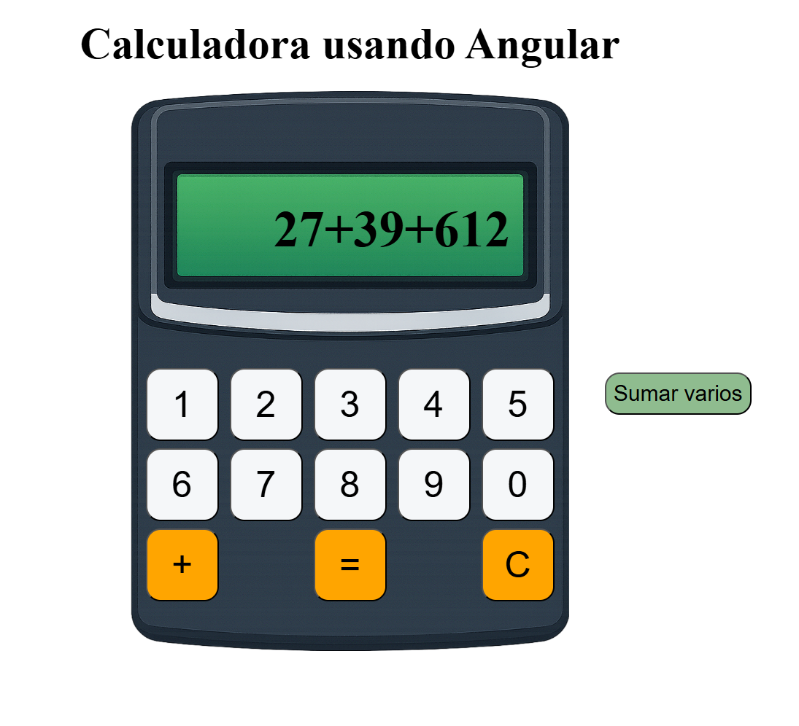

# Calculadora con Angular
Universidad Europea\
Desarrollo frontend con framework II\
Primer ejercicio entregable\
Gonzalo Martínez Iáñez

## Instalación y ejecución
Descargar el repositorio, instalar las dependencias y lanzar el servidor en modo de desarrollo con:
```
npm install
ng serve
```

## Descripción
Aplicación web de una calculadora sencilla que suma dos o múltiples números, pero no admite más dígitos totales que el ancho de la pantalla de la calculadora.

En la descipción del ejecicio solo se pedía sumar dos dígitos. Pero he decidido ampliar la funcionalidad para que ahora acepte la suma de más de dos números con más de un dígito.

También he considerado casos extraños como pulsar el botón "+" o "=" cuando no hay ningún número seleccionado o impedir que se desborde la pantalla con números muy grandes.

En cuanto al css, he decidido usar position: relative para la imagen de la calculadora y los botones con position: absolute respecto a su padre. Además he usado la unidad de medida px para ajustar perfectamente los botones y display: flex con space-between para la distribución de los botones. También se podría haber realizado con display: grid.

## Demo
La aplicación está desplegada en la siguiente url: https://calculadora-suma-two.vercel.app

